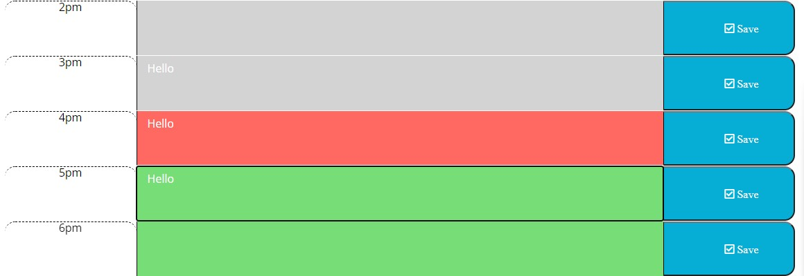

# Work Day Planner

### Purpose:

* To create a basic daily work schedule for users to input tasks

### Written with:
* HTML
* CSS
* JS
* BOOTSTRAP
* JQUERY
* MOMENT.JS

## Website:
https://nchan22.github.io/day-planner/

## Future Uses:
* Update for more advanced options for inputting text (e.g. time or text box)
* Update to allow user to suggest questions
* Update to provide more options of inputing different tasks (e.g. implementing into calendars)

## Screenshots

## Contributors:
Starter Code by Xandromus (https://github.com/coding-boot-camp/super-disco)
Written by Nathaniel Chan
